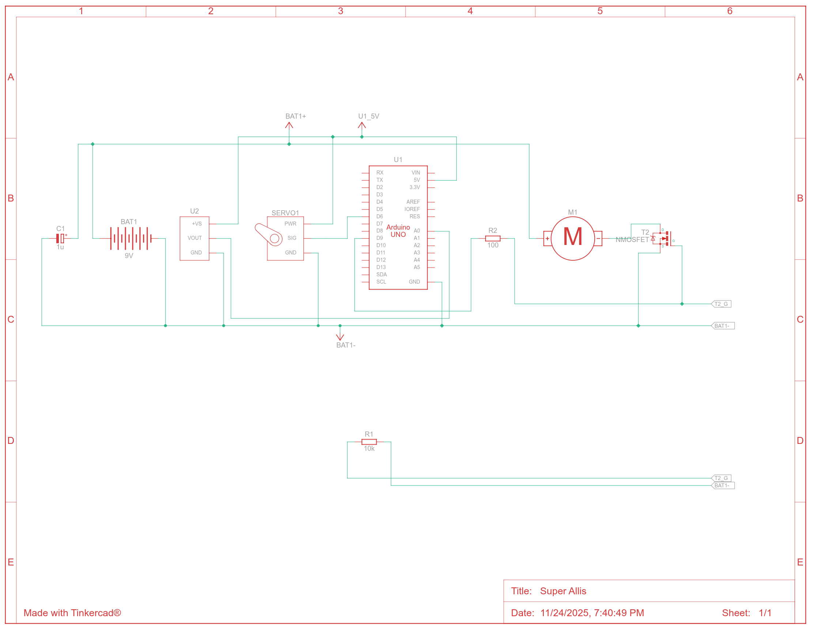

# Automated Greenhouse Ventilation System

This project is a small-scale automated greenhouse ventilation system designed to maintain optimal temperature conditions using a fan and a servo-controlled window. The system monitors the internal temperature and adjusts ventilation accordingly.
It was designed for the Fundamentals in Mechatronics and Automation course exam delivery.

## Features

- **Temperature-based control**: Monitors greenhouse temperature using a sensor (simulated in the code for testing).  
- **Fan control**: Turns on the fan when temperature exceeds a set threshold.  
- **Servo-controlled window**: Opens the window for additional ventilation if temperature rises further.  
- **Finite State Machine (FSM)**: System transitions between three states — IDLE, COOLING, and VENTING — to efficiently manage cooling.  
- **Easy-to-modify thresholds**: Temperature thresholds for fan activation, window opening, and reset are adjustable.  

## Hardware Used

- Arduino (any standard board)  
- Temperature sensor (analog input)  
- Servo motor (for window)  
- Fan (DC or PWM-controlled)  

## How it Works

1. The system continuously reads temperature values.  
2. Based on predefined thresholds:  
   - **IDLE**: Fan and window are off.  
   - **COOLING**: Fan turns on, window remains closed.  # Automated Greenhouse Ventilation System

This project is a small-scale automated greenhouse ventilation system designed to maintain optimal temperature conditions using a fan and a servo-controlled window. The system monitors the internal temperature and adjusts ventilation accordingly.

## Features

- **Temperature-based control**: Monitors greenhouse temperature using a sensor (simulated in the code for testing).  
- **Fan control**: Turns on the fan when temperature exceeds a set threshold.  
- **Servo-controlled window**: Opens the window for additional ventilation if temperature rises further.  
- **Finite State Machine (FSM)**: System transitions between three states — IDLE, COOLING, and VENTING — to efficiently manage cooling.  
- **Easy-to-modify thresholds**: Temperature thresholds for fan activation, window opening, and reset are adjustable.  

## Hardware Used

- Arduino (any standard board)  
- Temperature sensor (analog input)  
- Servo motor (for window)  
- Fan (DC or PWM-controlled)  

## How it Works

1. The system continuously reads temperature values.  
2. Based on predefined thresholds:  
   - **IDLE**: Fan and window are off.  
   - **COOLING**: Fan turns on, window remains closed.  
   - **VENTING**: Fan stays on, window opens for additional ventilation.  
3. The FSM handles smooth transitions between these states to avoid unnecessary fan/window activity.  

## Simulation

- For testing without real hardware, the temperature is simulated to increase and decrease over time.  
- Remove the simulation section to use a real temperature sensor.  

## Pictures

